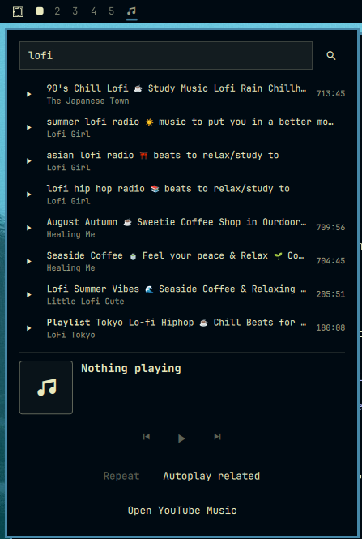

# Media Search

A drop-in replacement for Omarchy's built-in media widget. It keeps everything
`omarchy.media` does — MPRIS now-playing, transport controls, source switching,
hardware media keys — and adds a search panel that finds tracks on YouTube and
streams the pick through `mpv`.

Because `mpv` registers on MPRIS, a track started from the panel flows back
through this same service as an ordinary player. The now-playing readout and
the transport buttons need no special casing for it.



## Features

- Search YouTube from the bar and play a result without opening a browser
- Autoplay related: when a locally streamed track ends on its own, queue the
  next entry from YouTube's auto-generated radio mix for that video
- Repeat, driven by the active player's own MPRIS `LoopStatus`, so it works for
  any source that supports it — not just tracks this widget started
- Scrolling title in the bar, album art, album line, and a source list when more
  than one player is live
- One-click launch of the YouTube Music web app
- Keyboard-navigable panel: type to search, `Down` into the results, `Enter` to
  play, `Escape` to back out

## Install

```bash
omarchy plugin add https://github.com/mechurisr/omarchy-media-search.git --enable
```

Enabling it replaces the built-in media widget: the manifest declares
`omarchy.clonedFrom: "omarchy.media"`, so Omarchy takes the built-in's slot in
your bar layout and adds `omarchy.media` to `disabledPlugins`. Removing this
plugin puts the built-in back.

### Requirements

`mpv`, `mpv-mpris`, and `yt-dlp`. All three are in `omarchy-base.packages`, so a
standard Omarchy install already has them and there is nothing extra to install.

`mpv-mpris` must be autoloaded, which it is when `/etc/mpv/scripts/mpris.so`
exists — that is where the package puts it. Without it, a track started from the
search panel plays but never appears in the widget.

Built against the Omarchy 4.0 shell (`qs.Ui`, `qs.Commons`).

## Media keys

The service keeps the built-in's `media` IPC target, which is what Omarchy's own
media-key bindings call:

```
omarchy-shell media playPause | next | previous | play | pause | status
```

So `XF86AudioPlay` and friends keep working with no changes on your side.

## Opening the search panel from a keybinding

The panel has its own short IPC target. Plugins cannot ship Hyprland
keybindings, so add one yourself in `~/.config/hypr/bindings.lua`:

```lua
-- Music search: opens the Media Search bar widget's search panel, which takes
-- keyboard focus, so you can type a query straight away.
o.bind("SUPER + M", "Music search", "omarchy-shell media-search toggle")
```

`open` and `close` are available alongside `toggle`.

## YouTube Music

The **Open YouTube Music** button runs:

```
omarchy-launch-webapp https://music.youtube.com/
```

`omarchy-launch-webapp` ships with Omarchy and opens the URL as an app window in
your default supported browser (falling back to Chromium). There is no account
linking, API key, or OAuth step — the widget never talks to YouTube Music
itself. It only picks the session up over MPRIS once the browser starts playing,
the same way it picks up Spotify or VLC.

Two optional extras:

- **A desktop launcher and icon.** The button alone does not create one. If you
  want YouTube Music in your app launcher too:

  ```bash
  omarchy-webapp-install "YouTube Music" https://music.youtube.com/ youtube-music
  ```

- **Browser MPRIS.** Chromium and Chrome expose `org.mpris.MediaPlayer2.chromium`
  by default on Linux, so this normally needs no setup. If the widget stays
  blank while the web app is playing, check that
  `chrome://flags/#hardware-media-key-handling` is not set to **Disabled** —
  turning it off also removes the browser from the MPRIS bus.

To point the button somewhere else, set `launchCommand` on the widget's entry
in `~/.config/omarchy/shell.json`:

```json
{
  "id": "mechurisr.media-search",
  "launchCommand": "omarchy-launch-webapp https://open.spotify.com/"
}
```

## Controls

| Input | Action |
| --- | --- |
| Left click | Open or close the panel |
| Middle click | Play or pause |
| Right click | Next track |
| Wheel over the widget | Previous / next track |
| `Down` in the search field | Move into the results |
| `Up` / `Down` in the results | Move the cursor |
| `Enter` | Play the selected result |
| `Escape` | Back to the search field, or close the panel |

The stop button (`󰓛`) appears only while `mpv` is the active source — it stops
playback this widget started, and means nothing for other players.

Repeat and Autoplay related are mutually exclusive: a looping track never
reaches EOF, so autoplay would never get a chance to fire. Turning one on clears
the other.

## Privacy

Search runs `yt-dlp` against YouTube directly from your machine, and playback
streams from YouTube through `mpv`. No credentials are read or stored, and
nothing is sent anywhere else. Result titles and uploader names are rendered as
plain text.

## Develop

```bash
omarchy plugin validate .
```
