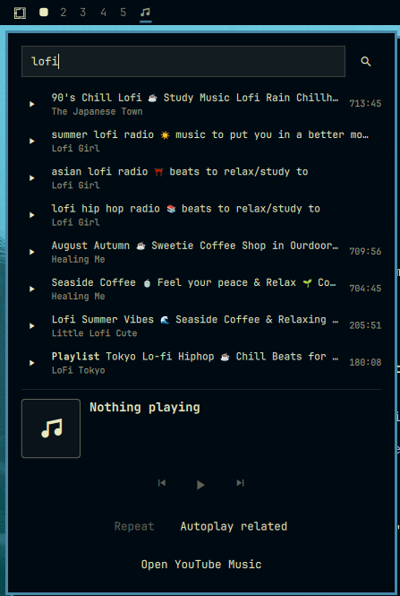

# Media Search

A drop-in replacement for Omarchy's built-in media widget. It keeps everything
`omarchy.media` does — MPRIS now-playing, transport controls, source switching,
hardware media keys — and adds a search panel that finds tracks on YouTube and
streams the pick through `mpv`.

Because `mpv` registers on MPRIS, a track started from the panel flows back
through this same service as an ordinary player. The now-playing readout and
the transport buttons need no special casing for it.



## Features

- Search YouTube from the bar and play a result without opening a browser
- Watch any YouTube result in an `mpv` video window, or open the currently playing
  YouTube track from the panel
- Search Spotify too, and start the pick on your Spotify app — see
  [Spotify](#spotify)
- Autoplay related: when a locally streamed track ends on its own, queue the
  next entry from YouTube's auto-generated radio mix for that video
- Repeat, driven by the active player's own MPRIS `LoopStatus`, so it works for
  any source that supports it — not just tracks this widget started
- Scrolling title in the bar, album art, album line, and a source list when more
  than one player is live
- One-click launch of the YouTube Music web app
- Keyboard-navigable panel: type to search, `Down` into the results, `Enter` to
  play, `Escape` to back out

## Install

```bash
omarchy plugin add https://github.com/mechurisr/omarchy-media-search.git --enable
```

Enabling it replaces the built-in media widget: the manifest declares
`omarchy.clonedFrom: "omarchy.media"`, so Omarchy takes the built-in's slot in
your bar layout and adds `omarchy.media` to `disabledPlugins`. Removing this
plugin puts the built-in back — see [Removing](#removing) for the one case that
needs a manual step.

### Updating

```bash
omarchy plugin update mechurisr.media-search
omarchy restart shell
```

The restart is not optional. `omarchy plugin update` ends in a plugin rescan,
which reloads bar widgets in place — but this plugin's manifest sets
`keepLoaded: true`, and since Omarchy 4.0.3 a `keepLoaded` service survives that
reload instead of being torn down and rebuilt. Without the restart you end up
running the new `BarWidget.qml` against the old `Service.qml`.

`keepLoaded` earns its place the rest of the time: the `mpv` process is a child
of the service, so keeping the service mounted means an unrelated plugin's
reload no longer stops whatever you are listening to.

What changed in each version is on the
[releases page](https://github.com/mechurisr/omarchy-media-search/releases).
Tags are for reading only — `omarchy plugin update` fetches `origin HEAD` and
fast-forwards, so it always tracks `main` rather than the latest tag.
The Omarchy 4.0.3 compatibility work is
[v1.0.1](https://github.com/mechurisr/omarchy-media-search/releases/tag/v1.0.1).

### Removing

```bash
omarchy plugin remove mechurisr.media-search
```

The built-in media widget comes back in the same bar slot, and this is the one
path that needs no shell restart: a removed plugin's service is destroyed on
the rescan that follows, `keepLoaded` or not. Whatever the widget was streaming
stops with it — `mpv` runs as a child of the service, so it exits rather than
being left playing with nothing left to stop it.

One case needs a manual step. Omarchy re-enables `omarchy.media` on removal
only when *this* plugin is what disabled it, which it records in
`cloneSourceRestores` in `shell.json`. If the built-in was already disabled when
you enabled this plugin — another clone of `omarchy.media` got there first, or
you had switched it off yourself — removal restores the bar entry but leaves the
built-in disabled, so the slot renders empty. Put it back with:

```bash
omarchy-shell shell setPluginEnabled omarchy.media true
```

### Requirements

`mpv`, `mpv-mpris`, and `yt-dlp`. All three are in `omarchy-base.packages`, so a
standard Omarchy install already has them and there is nothing extra to install.

`mpv-mpris` must be autoloaded, which it is when `/etc/mpv/scripts/mpris.so`
exists — that is where the package puts it. Without it, a track started from the
search panel plays but never appears in the widget.

The built-in bar (`omarchy.bar`). Omarchy 4.0.3 hands widgets rendered by a
third-party replacement bar a shell facade with no service lookup on it, so
under such a bar this widget cannot reach its own service: now-playing stays
empty, the transport buttons have no player to act on, and the panel says the
search is unavailable. Only the **Open YouTube Music** button still does
anything. The service itself is unaffected — it is loaded by the shell, not by
the bar — so the `media` IPC target and your media keys keep working. There is
no workaround on the plugin side: the host withholds the lookup deliberately,
so an untrusted bar cannot retrieve any plugin's live service object.

Built against the Omarchy 4.0 shell (`qs.Ui`, `qs.Commons`); verified against
4.0.3, where third-party plugins receive capability-scoped facades in place of
the host `bar` and `shell` objects.

## Media keys

The service keeps the built-in's `media` IPC target, which is what Omarchy's own
media-key bindings call:

```
omarchy-shell media playPause | next | previous | play | pause | status
```

So `XF86AudioPlay` and friends keep working with no changes on your side.

## Opening the search panel from a keybinding

The panel has its own short IPC target. Plugins cannot ship Hyprland
keybindings, so add one yourself in `~/.config/hypr/bindings.lua`:

```lua
-- Music search: opens the Media Search bar widget's search panel, which takes
-- keyboard focus, so you can type a query straight away.
o.bind("SUPER + M", "Music search", "omarchy-shell media-search toggle")
```

`open` and `close` are available alongside `toggle`.

## Spotify

Switch the panel to **Spotify** with the chip above the search field, or `Tab`
in the field. What you get depends on how far you set it up:

| Setup | Search | Playing a result |
| --- | --- | --- |
| Nothing | Opens the query in the Spotify app (or the web player) | — |
| Connected, free account | Results in the panel | Opens the track in the Spotify app |
| Connected, Premium | Results in the panel | Starts on a Spotify Connect device |

Connecting needs your own Spotify developer app. Since February 2026 Spotify
only runs development-mode apps whose owner has Premium, so on a free account
you can stop at "Nothing". Everything still works, just from the Spotify app.

1. Create an app at <https://developer.spotify.com/dashboard>, with **Web API**
   selected and this redirect URI:

   ```
   http://127.0.0.1:8898/callback
   ```

2. Press **Connect** in the panel, or run `spotify-helper login` from the plugin
   directory, and paste the app's Client ID. The browser opens for you to
   approve access.

Playback goes to the device already active in your account; with none active,
the helper starts the desktop app (`spotify-launcher` from `extra`) and waits
for it to show up. Now-playing and the transport buttons come from the app's
own MPRIS player, so they need no Spotify-specific handling.

**Autoplay related** works for Spotify too, but differently. A Spotify track
started on its own just stops at the end, because Spotify's own autoplay does
not pick it up. The endpoints that find similar music (recommendations,
related artists, artist top tracks) are closed to development-mode apps. So
with Autoplay related on, a Spotify pick starts with up to 20 more songs by
the same artist queued behind it, in shuffled order: an artist mix rather than
a radio. It applies to the next pick, not to what is already playing.

### Headless playback with spotifyd

With the desktop app as the player, closing its window stops the music.
[spotifyd](https://github.com/Spotifyd/spotifyd) (`extra`) is a windowless
Connect device that runs as a user service instead. It is opt-in: the helper
uses it only while its user unit is enabled.

```bash
sudo pacman -S spotifyd
spotifyd authenticate            # browser login, cached under cache_path
systemctl --user enable --now spotifyd
```

A minimal `~/.config/spotifyd/spotifyd.conf`:

```toml
[global]
device_name = "Omarchy"
backend = "pulseaudio"
use_mpris = true
autoplay = true
```

Spotify sometimes refuses librespot-based players the decryption key for an
account (`error audio key 0 1` in `journalctl --user -u spotifyd`), and the
Web API still reports such a track as playing for a few seconds. So after
starting a track on spotifyd the helper waits for spotifyd's audio stream to
show up in PipeWire. If it does not, the track goes to the desktop app
instead, and spotifyd is skipped for an hour so later picks do not wait on
it. To retry sooner, delete
`$XDG_STATE_HOME/omarchy-media-search/spotifyd.json`.

To use another port, set `MEDIA_SEARCH_SPOTIFY_PORT` and register the matching
redirect URI. To disconnect, run `spotify-helper logout`, and remove access at
<https://www.spotify.com/account/apps/>.

## YouTube Music

The **Open YouTube Music** button runs:

```
omarchy-launch-webapp https://music.youtube.com/
```

`omarchy-launch-webapp` ships with Omarchy and opens the URL as an app window in
your default supported browser (falling back to Chromium). There is no account
linking, API key, or OAuth step — the widget never talks to YouTube Music
itself. It only picks the session up over MPRIS once the browser starts playing,
the same way it picks up Spotify or VLC.

Two optional extras:

- **A desktop launcher and icon.** The button alone does not create one. If you
  want YouTube Music in your app launcher too:

  ```bash
  omarchy-webapp-install "YouTube Music" https://music.youtube.com/ youtube-music
  ```

- **Browser MPRIS.** Chromium and Chrome expose `org.mpris.MediaPlayer2.chromium`
  by default on Linux, so this normally needs no setup. If the widget stays
  blank while the web app is playing, check that
  `chrome://flags/#hardware-media-key-handling` is not set to **Disabled** —
  turning it off also removes the browser from the MPRIS bus.

To point the button somewhere else, set `launchCommand` on the widget's entry
in `~/.config/omarchy/shell.json`:

```json
{
  "id": "mechurisr.media-search",
  "launchCommand": "omarchy-launch-webapp https://open.spotify.com/"
}
```

## Controls

| Input | Action |
| --- | --- |
| Left click | Open or close the panel |
| Middle click | Play or pause |
| Right click | Next track |
| Wheel over the widget | Previous / next track |
| `Down` in the search field | Move into the results |
| `Up` / `Down` in the results | Move the cursor |
| `Enter` | Play the selected result |
| `Watch` beside a YouTube result | Play its video in an `mpv` window |
| `Escape` | Back to the search field, or close the panel |

The stop button (`󰓛`) appears only while `mpv` is the active source — it stops
playback this widget started, and means nothing for other players.
**Watch video** appears while a YouTube track started by this plugin is playing.
Opening a video replaces the plugin's background audio stream with a visible
`mpv` player. Switching the current track keeps its playback position when
MPRIS reports it. Closing the video window stops playback.

Repeat and Autoplay related are mutually exclusive: a looping track never
reaches EOF, so autoplay would never get a chance to fire. Turning one on clears
the other.

## Privacy

Search runs `yt-dlp` against YouTube directly from your machine, and playback
streams from YouTube through `mpv`. Result titles and uploader names are
rendered as plain text.

YouTube needs no credentials. Once you connect Spotify, `spotify-helper` keeps a
refresh token and your app's Client ID in
`$XDG_STATE_HOME/omarchy-media-search/spotify.json` (mode `0600`). It talks only
to Spotify's own API. The token never reaches the shell process, and no client
secret is involved because the login uses PKCE.

## Develop

```bash
omarchy plugin validate .
```
